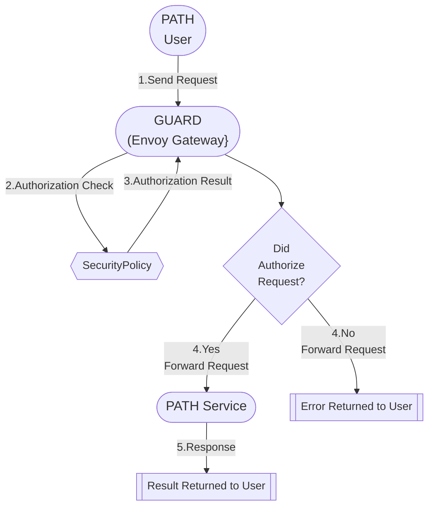
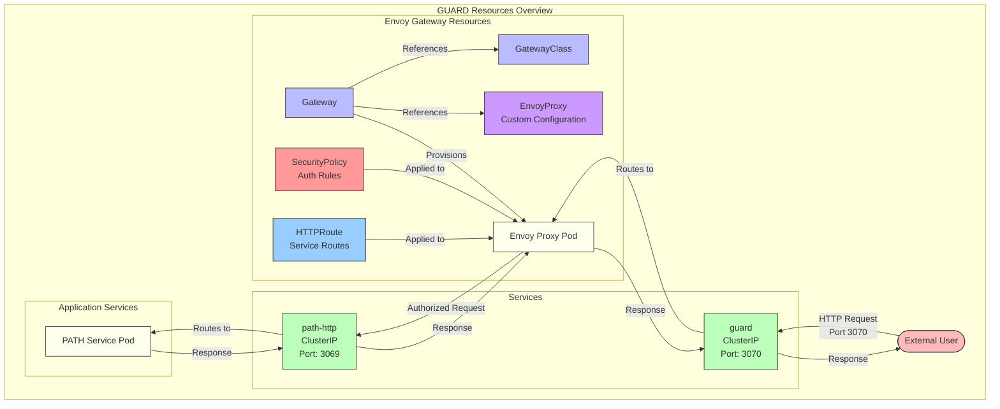

# GUARD - Gateway Utilities for Authentication, Routing & Defense <!-- omit in toc -->

- [Overview](#overview)
- [Architecture](#architecture)
  - [Envoy Gateway](#envoy-gateway)
  - [GUARD Resources](#guard-resources)
- [Prerequisites](#prerequisites)
- [Installation](#installation)
  - [Add Required Helm Repositories](#add-required-helm-repositories)
  - [Install the Chart](#install-the-chart)
- [Key Features](#key-features)
- [Configuration](#configuration)

## Overview

**GUARD** (Gateway Utilities for Authentication, Routing & Defense) is the web2 gateway layer for PATH. It acts as the entry point and security layer for all external traffic to PATH services, providing:

1. **Authentication** - Verifies API keys and manages user access
2. **Service Routing** - Creates the appropriate `HTTPRoute` resources for the services configured in the Helm values file.
3. **Defense Mechanisms** - Implements rate limiting and security policies

GUARD uses Envoy Gateway as its underlying proxy technology and is deployed using Helm.



## Architecture

GUARD is built on Envoy Gateway and implements the Kubernetes Gateway API to provide robust gateway functionality.

### Envoy Gateway

<div align="center">
  <a href="https://gateway.envoyproxy.io/docs/">
    
  </a>
  <br/>
  <a href="https://gateway.envoyproxy.io/docs/">
    <h2>Envoy Gateway Docs</h2>
  </a>
</div>

Envoy Gateway is an open source project for managing Envoy Proxy as a standalone or Kubernetes-based application gateway. Gateway API resources are used to dynamically provision and configure the managed Envoy Proxies.

- [Envoy Gateway Quickstart](https://gateway.envoyproxy.io/docs/tasks/quickstart/)
- [Envoy Gateway Resources](https://gateway.envoyproxy.io/docs/concepts/concepts_overview/)
- [Envoy Gateway API Reference](https://gateway.envoyproxy.io/docs/api/)

### GUARD Resources



## Prerequisites

1. [Kubernetes](https://kubernetes.io/releases/download/) 1.16+
2. [Helm](https://helm.sh/docs/helm/helm_install/) 3.1+

## Installation

### Add Required Helm Repositories

```bash
helm repo add grove https://buildwithgrove.github.io/helm-charts
helm repo update
```

### Install the Chart

GUARD is designed to route requests to PATH services. It is not a standalone service and should be deployed as part of the PATH chart.

See the [PATH README](../path/README.md#deployment-options) for more information on installing the PATH chart.

## Key Features

GUARD provides several key features for managing access to your services:

1. **Flexible Routing**

   - Subdomain-based routing
   - Header-based routing
   - Custom path configurations

2. **Authentication Methods**

   - API key authentication
   - Grove legacy authentication

3. **Defense Mechanisms**
   - Request validation
   - Rate limiting

## Configuration

The GUARD Helm chart is highly configurable through values in your `values.yaml` file. Key parameters include:

| Parameter               | Description                        | Default            |
| ----------------------- | ---------------------------------- | ------------------ |
| `fullnameOverride`      | Override for the name of resources | `guard`            |
| `global.serviceName`    | Name of the backend service        | `path-http`        |
| `global.port`           | Port of the backend service        | `3069`             |
| `gateway.port`          | Port for the gateway               | `3070`             |
| `domain`                | Domain for the gateway             | `""`               |
| `services`              | List of services to route          | `[]`               |
| `auth.apiKey.enabled`   | Enable API key authentication      | `false`            |
| `auth.apiKey.headerKey` | Header key for API key             | `"authorization"`  |
| `auth.apiKey.apiKeys`   | List of API keys                   | `["test_api_key"]` |

For a complete list of configuration options, see the [values.yaml](https://github.com/buildwithgrove/helm-charts/blob/main/charts/guard/values.yaml) file.
