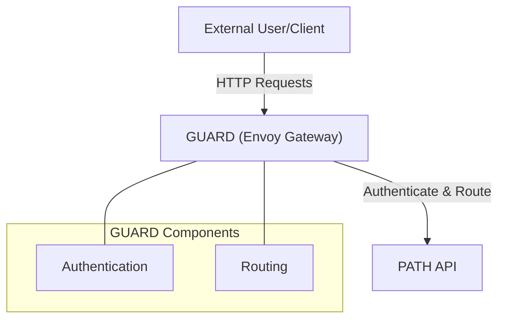
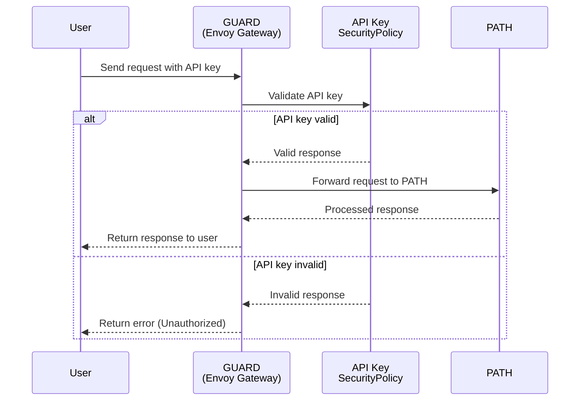

# GUARD - Gateway Utilities for Authentication, Routing & Defense <!-- omit in toc -->

A Helm chart for deploying GUARD, a gateway layer providing authentication, routing, and defense capabilities for services like PATH.

- [Overview](#overview)
- [Architecture](#architecture)
  - [Envoy Gateway](#envoy-gateway)
  - [Request Flow](#request-flow)
- [Prerequisites](#prerequisites)
- [Installation](#installation)
  - [Add Required Helm Repositories](#add-required-helm-repositories)
  - [Install the Chart](#install-the-chart)
- [Key Features](#key-features)
- [Configuration](#configuration)
- [Routing Capabilities](#routing-capabilities)
  - [Subdomain-Based Routing](#subdomain-based-routing)
  - [Header-Based Routing](#header-based-routing)
  - [Route Examples](#route-examples)
- [Authentication Methods](#authentication-methods)
  - [API Key Authentication](#api-key-authentication)
- [Security Considerations](#security-considerations)
- [Extending GUARD](#extending-guard)
- [Uninstalling](#uninstalling)

## Overview

**GUARD** (Gateway Utilities for Authentication, Routing & Defense) is the web2 gateway layer for PATH. It acts as the entry point and security layer for all external traffic to PATH services, providing:

1. **Authentication** - Verifies API keys and manages user access
2. **Service Routing** - Creates the appropriate `HTTPRoute` resources for the services configured in the Helm values file.
3. **Defense Mechanisms** - Implements rate limiting and security policies 
  
GUARD uses Envoy Gateway as its underlying proxy technology and is deployed using Helm.



## Architecture

GUARD is built on Envoy Gateway and implements the Kubernetes Gateway API to provide robust gateway functionality.

### Envoy Gateway

<div align="center">
  <a href="https://gateway.envoyproxy.io/docs/">
    
  </a>
  <br/>
  <a href="https://gateway.envoyproxy.io/docs/">
    <h2>Envoy Gateway Docs</h2>
  </a>
</div>

Envoy Gateway is an open source project for managing Envoy Proxy as a standalone or Kubernetes-based application gateway. Gateway API resources are used to dynamically provision and configure the managed Envoy Proxies.

- [Envoy Gateway Quickstart](https://gateway.envoyproxy.io/docs/tasks/quickstart/)
- [Envoy Gateway Resources](https://gateway.envoyproxy.io/docs/concepts/concepts_overview/)
- [Envoy Gateway API Reference](https://gateway.envoyproxy.io/docs/api/)

### Request Flow



## Prerequisites

1. [Kubernetes](https://kubernetes.io/releases/download/) 1.16+
2. [Helm](https://helm.sh/docs/helm/helm_install/) 3.1+

## Installation

### Add Required Helm Repositories

```bash
helm repo add grove https://buildwithgrove.github.io/helm-charts
helm repo update
```

### Install the Chart

GUARD is designed to route requests to PATH services. It is not a standalone service and should be deployed as part of the PATH chart.

See the [PATH README](../path/README.md#deployment-options) for more information on installing the PATH chart.

## Key Features

GUARD provides several key features for managing access to your services:

1. **Flexible Routing**
   - Subdomain-based routing
   - Header-based routing
   - Custom path configurations

2. **Authentication Methods**
   - API key authentication
   - Grove legacy authentication
  
3. **Defense Mechanisms**
   - Request validation
   - Rate limiting
   - Security policies

## Configuration

The GUARD Helm chart is highly configurable through values in your `values.yaml` file. Key parameters include:

| Parameter               | Description                        | Default            |
| ----------------------- | ---------------------------------- | ------------------ |
| `fullnameOverride`      | Override for the name of resources | `guard`            |
| `global.serviceName`    | Name of the backend service        | `path-http`        |
| `global.port`           | Port of the backend service        | `3069`             |
| `gateway.port`          | Port for the gateway               | `3070`             |
| `domain`                | Domain for the gateway             | `""`               |
| `services`              | List of services to route          | `[]`               |
| `auth.apiKey.enabled`   | Enable API key authentication      | `false`            |
| `auth.apiKey.headerKey` | Header key for API key             | `"authorization"`  |
| `auth.apiKey.apiKeys`   | List of API keys                   | `["test_api_key"]` |

For a complete list of configuration options, see the [values.yaml](https://github.com/buildwithgrove/helm-charts/blob/main/charts/guard/values.yaml) file.

## Routing Capabilities

GUARD provides two primary routing methods:

### Subdomain-Based Routing

Subdomain-based routing directs traffic based on the subdomain in the request URL. This type of routing is configured in the `httproute-subdomain.yaml` template.

**Example Configuration:**

```yaml
services:
  - serviceId: F00C
    aliases:
      - eth
      - eth-mainnet
  - serviceId: F021
    aliases:
      - polygon
```

With this configuration, GUARD will:

1. Create routes for each service ID and its aliases
2. Set the `target-service-id` header to the canonical service ID
3. Forward the request to the appropriate backend service

**URL Examples:**
- `https://F00C.path.example.com/v1` → Routes to PATH with `target-service-id: F00C`
- `https://eth.path.example.com/v1` → Routes to PATH with `target-service-id: F00C`
- `https://eth-mainnet.path.example.com/v1` → Routes to PATH with `target-service-id: F00C`
- `https://polygon.path.example.com/v1` → Routes to PATH with `target-service-id: F021`

### Header-Based Routing

Header-based routing directs traffic based on the `target-service-id` header in the request. This type of routing is configured in the `httproute-header.yaml` template.

**Example Configuration:**

Using the same services configuration as above, header-based routing enables clients to specify the target service in the header:

**URL and Header Examples:**
- `https://path.example.com/v1` with header `-H "target-service-id: F00C"` → Routes to PATH with `target-service-id: F00C`
- `https://path.example.com/v1` with header `-H "target-service-id: eth"` → Routes to PATH with `target-service-id: F00C`
- `https://path.example.com/v1` with header `-H "target-service-id: polygon"` → Routes to PATH with `target-service-id: F021`

### Route Examples

**Example 1: Using curl with subdomain routing**

```bash
# Route to ETH service using subdomain
curl https://eth.path.example.com/v1
  -H "Authorization: test_api_key"  
  -d '{"jsonrpc":"2.0","method":"eth_blockNumber","params":[],"id":1}'
```

**Example 2: Using curl with header routing**

```bash
# Route to ETH service using header
curl https://path.example.com/v1
  -H "Target-Service-Id: eth" 
  -H "Authorization: test_api_key" 
  -d '{"jsonrpc":"2.0","method":"eth_blockNumber","params":[],"id":1}'
```

## Authentication Methods

:::info

GUARD currently supports API key authentication.

More authentication methods will be added in the future, as [Envoy Gateway](https://gateway.envoyproxy.io/) supports multiple methods, such as:

- [JWT Authentication](https://gateway.envoyproxy.io/docs/tasks/security/jwt-authentication/)
- [OIDC Authentication](https://gateway.envoyproxy.io/docs/tasks/security/oidc/)
- [Basic Authentication](https://gateway.envoyproxy.io/docs/tasks/security/basic-auth/)

:::

### API Key Authentication

API key authentication allows you to secure your services with API keys. This authentication method is configured in the `auth-api-key` templates.

**Enabling API Key Authentication:**

1. Configure API key authentication in your `values.yaml` file:

```yaml
auth:
  apiKey:
    enabled: true
    headerKey: "Authorization"  # Header to extract API key from
    apiKeys:
      - "test_api_key_1"
      - "test_api_key_2"
```

2. The chart will create:
   - A Kubernetes Secret containing the API keys
   - SecurityPolicy resources for each service and routing method

**Security Policy Configuration:**

For each service and routing method (subdomain and header), GUARD creates a SecurityPolicy that:
1. References the appropriate HTTPRoute
2. Configures API key extraction from the specified header
3. Validates the API key against the stored credentials

## Security Considerations

For production deployments:

1. Use strong, unique API keys
2. Configure TLS for all endpoints

## Extending GUARD

GUARD is designed to be extensible:

1. **Custom Routes** - Add custom routing rules for specialized traffic patterns
2. **Authentication Methods** - Implement additional authentication providers
3. **Defense Mechanisms** - Add custom rate limiting or security policies

## Uninstalling

```bash
helm uninstall guard
```
