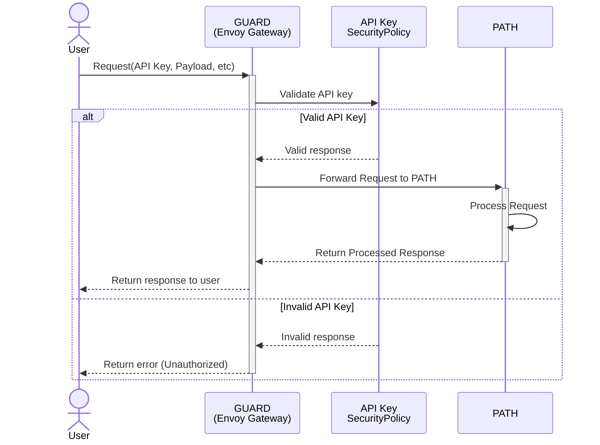

# Authentication Methods <!-- omit in toc -->

## Table of Contents <!-- omit in toc -->

- [Authentication Methods](#authentication-methods)
- [API Key Authentication](#api-key-authentication)
  - [API Key Request Flow](#api-key-request-flow)
  - [Enabling API Key Authentication](#enabling-api-key-authentication)
  - [Security Policy Configuration](#security-policy-configuration)

## Authentication Methods

As of 05/2025, GUARD only supports API key authentication.

More authentication methods will be added in the future.

We'll be following and adopting [Envoy Gateway](https://gateway.envoyproxy.io/)'s auth roadmap:

- [JWT Authentication](https://gateway.envoyproxy.io/docs/tasks/security/jwt-authentication/)
- [OIDC Authentication](https://gateway.envoyproxy.io/docs/tasks/security/oidc/)
- [Basic Authentication](https://gateway.envoyproxy.io/docs/tasks/security/basic-auth/)

## API Key Authentication

API key authentication allows you to secure your services with API keys. This authentication method is configured in the `auth-api-key` templates.

### API Key Request Flow



### Enabling API Key Authentication

Configure API key authentication in your `values.yaml` file:

```yaml
auth:
  apiKey:
    enabled: true
    headerKey: "Authorization" # Header to extract API key from
    apiKeys:
      - "test_api_key_1"
      - "test_api_key_2"
```

The chart above will create:

- A Kubernetes Secret containing the API keys
- SecurityPolicy resources for each service and routing method

:::note headerKey
The `headerKey` field specifies the header to extract the API key from.

You can customize this value to match your service.
:::

### Security Policy Configuration

For each service and routing method (subdomain and header), GUARD creates a SecurityPolicy that:

1. References the appropriate [HTTPRoute](https://gateway-api.sigs.k8s.io/api-types/httproute/)
2. Configures API key extraction from the specified header
3. Validates the API key against the stored credentials

**For further information on GUARD's routing capabilities, see the [Routing documentation section](routing.md).**
