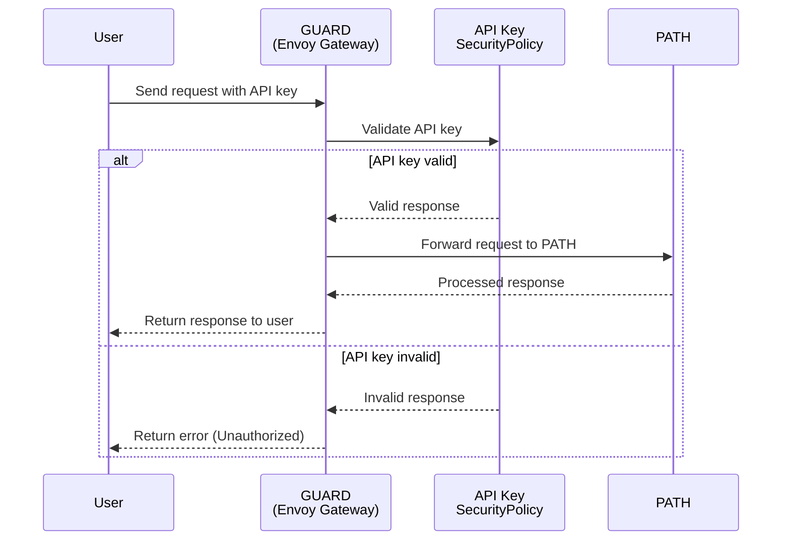

## Authentication Methods

:::info

GUARD currently supports API key authentication.

More authentication methods will be added in the future, as [Envoy Gateway](https://gateway.envoyproxy.io/) supports multiple methods, such as:

- [JWT Authentication](https://gateway.envoyproxy.io/docs/tasks/security/jwt-authentication/)
- [OIDC Authentication](https://gateway.envoyproxy.io/docs/tasks/security/oidc/)
- [Basic Authentication](https://gateway.envoyproxy.io/docs/tasks/security/basic-auth/)

:::

### API Key Authentication

API key authentication allows you to secure your services with API keys. This authentication method is configured in the `auth-api-key` templates.

#### Request Flow



**Enabling API Key Authentication:**

1. Configure API key authentication in your `values.yaml` file:

```yaml
auth:
  apiKey:
    enabled: true
    headerKey: "Authorization"  # Header to extract API key from
    apiKeys:
      - "test_api_key_1"
      - "test_api_key_2"
```

2. The chart will create:
   - A Kubernetes Secret containing the API keys
   - SecurityPolicy resources for each service and routing method

**Security Policy Configuration:**

For each service and routing method (subdomain and header), GUARD creates a SecurityPolicy that:
1. References the appropriate HTTPRoute
2. Configures API key extraction from the specified header
3. Validates the API key against the stored credentials
