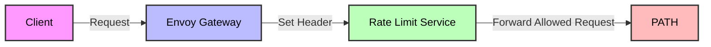

# Rate Limiting <!-- omit in toc -->

## Quick Start <!-- omit in toc -->

Enable rate limiting by default in `values.yaml`:

```yaml
rateLimit:
  enabled: true
  redis:
    enabled: true
  plans:
    - header: "Rl-Plan-Free"
      requests: 5000
      unit: Day
```

To test, send a request like:

```bash
curl http://rpc.grove.city/v1 \
  -H "Rl-Plan-Free: 1a2b3c4d" \
  -d '{"jsonrpc":"2.0","method":"eth_blockNumber","id":1}'
```

## Table of Contents <!-- omit in toc -->

- [Introduction](#introduction)
- [How Rate Limiting Works](#how-rate-limiting-works)
- [Header-Based Rate Limiting](#header-based-rate-limiting)
  - [Example Rate-Limited Request](#example-rate-limited-request)
  - [Setting Header Values](#setting-header-values)
- [Rate Limiting Configuration](#rate-limiting-configuration)
  - [Default Configuration](#default-configuration)
  - [Adding New Rate Limit Plans](#adding-new-rate-limit-plans)
  - [Multiple Rate Limits per Plan](#multiple-rate-limits-per-plan)
  - [Redis Configuration](#redis-configuration)
    - [Using External Redis](#using-external-redis)
- [Gateway Helm Configuration](#gateway-helm-configuration)
- [Common Tasks](#common-tasks)
- [Documentation References](#documentation-references)

## Introduction

A few quick notes to get you started:

- GUARD uses Envoy Gateway's Global Rate Limiting.
- Rate Limiting is configured in [`values.yaml`](https://github.com/buildwithgrove/helm-charts/blob/main/charts/guard/values.yaml).
- Redis is used as the backend for rate limiting.

## How Rate Limiting Works

- Rate limits are based on unique HTTP header values.
- Each unique header value = separate rate limit bucket.
- Example: `Rl-Plan-Free: 1a2b3c4d` and `Rl-Plan-Free: 9z8y7x6w` are tracked separately.

## Header-Based Rate Limiting

| Header Value   | Requests | Unit   | Example User ID |
| -------------- | -------- | ------ | --------------- |
| `Rl-Plan-Free` | `5000`   | Day    | `1a2b3c4d`      |
| `Rl-Plan-Free` | `30`     | Second | `1a2b3c4d`      |
| `Rl-Plan-Pro`  | `1000`   | Hour   | `5e6f7g8h`      |

- Each distinct user ID in the header gets its own rate bucket.
- Example: `Rl-Plan-Free: 1a2b3c4d` is limited to 5000/day and 30/second.

### Example Rate-Limited Request

```bash
curl http://rpc.grove.city/v1 \
  -H "Rl-Plan-Free: 1a2b3c4d" \
  -d '{"jsonrpc":"2.0","method":"eth_blockNumber","id":1}'
```

- User with `Rl-Plan-Free: 1a2b3c4d` can make 5000 requests/day.
- Exceeding this will result in HTTP 429 responses.

### Setting Header Values

- Set the header on every request downstream of the rate limit service.
- Ways to set headers:
  - [Envoy Gateway HTTP Request Header Modification](https://gateway.envoyproxy.io/docs/tasks/traffic/http-request-headers/)
  - [Envoy Gateway Custom External Authorization](https://gateway.envoyproxy.io/docs/tasks/security/ext-auth/)

> **TODO:** Provide better examples of how to set headers on requests.



## Rate Limiting Configuration

- All config is in `values.yaml` under `rateLimit`.
- Key parameters:

| Parameter                    | Description                                | Default          | Required |
| ---------------------------- | ------------------------------------------ | ---------------- | -------- |
| `rateLimit.enabled`          | Enable rate limiting                       | `true`           | ✅       |
| `rateLimit.redis.enabled`    | Deploy Redis from this chart               | `true`           | ❌       |
| `rateLimit.plans`            | Array of rate limit plans                  |                  | ✅       |
| `rateLimit.plans[].header`   | Header for identifying rate limit subjects | `"Rl-Plan-Free"` | ✅       |
| `rateLimit.plans[].requests` | Requests allowed per time unit             | `5000`           | ✅       |
| `rateLimit.plans[].unit`     | Time unit (Second, Minute, Hour, Day)      | `Day`            | ✅       |

### Default Configuration

```yaml
rateLimit:
  enabled: true
  redis:
    enabled: true
  plans:
    - header: "Rl-Plan-Free"
      requests: 5000
      unit: Day
```

- Limits each unique `Rl-Plan-Free` header value to 5000 requests/day.

### Adding New Rate Limit Plans

- Add new entries to the `plans` array.
- Example: Add a "pro" plan with 1000 requests/hour:

```yaml
plans:
  - header: "Rl-Plan-Free"
    requests: 5000
    unit: Day
  - header: "Rl-Plan-Pro"
    requests: 1000
    unit: Hour
```

- `Rl-Plan-Free: XXX` → 5000/day
- `Rl-Plan-Pro: XXX` → 1000/hour

### Multiple Rate Limits per Plan

- Add multiple entries with the same header for different units.
- Example: Limit "free" users to 5000/day **AND** 30/second:

```yaml
plans:
  - header: "Rl-Plan-Free"
    requests: 5000
    unit: Day
  - header: "Rl-Plan-Free"
    requests: 30
    unit: Second
```

### Redis Configuration

- **Redis is required** as a backend for rate limiting.
- By default, Redis is deployed by the chart.

#### Using External Redis

1. Set `rateLimit.redis.enabled: false`
2. Set the Redis URL in `gateway-helm.config.envoyGateway.rateLimit.backend.redis.url`
3. If using authentication, configure it separately.

Example:

```yaml
rateLimit:
  enabled: true
  redis:
    enabled: false
  plans:
    - header: "Rl-Plan-Free"
      requests: 5000
      unit: Day

gateway-helm:
  config:
    envoyGateway:
      rateLimit:
        backend:
          type: Redis
          redis:
            url: my-external-redis.example.com:6379
```

> **NOTE:** If you disable Redis deployment, you MUST set the correct external Redis URL as above.

## Gateway Helm Configuration

- The following config must be set in `gateway-helm` in `values.yaml`:

```yaml
gateway-helm:
  config:
    envoyGateway:
      rateLimit:
        backend:
          type: Redis
          redis:
            url: redis.path.svc.cluster.local:6379
```

- By default, this points to the Redis deployed by the chart in the same namespace.

:::note Disabling Redis

If `rateLimit.redis.enabled` is `false`, update the above URL to your external Redis.

:::

:::warning Modifying Namespace

If you change the namespace, update the Redis URL to `redis.<NAMESPACE>.svc.cluster.local:6379`.

:::

## Common Tasks

- **Enable/disable rate limiting:** Set `rateLimit.enabled: true|false` in `values.yaml`
- **Change rate limits:** Edit the `plans` array
- **Switch to external Redis:** See [Redis Configuration](#redis-configuration)
- **Change namespace:** Update Redis URL in `gateway-helm` config

## Documentation References

- [Envoy Gateway Helm Chart Values](https://github.com/envoyproxy/gateway/tree/main/charts/gateway-helm#values)
- [Envoy Gateway Helm Chart Values Template](https://github.com/envoyproxy/gateway/blob/main/charts/gateway-helm/values.tmpl.yaml)
- [Envoy Gateway Rate Limiting](https://gateway.envoyproxy.io/docs/tasks/traffic/global-rate-limit/)
- [Envoy Proxy Rate Limit HTTP Filter](https://www.envoyproxy.io/docs/envoy/latest/configuration/http/http_filters/rate_limit_filter)
- [Envoy Proxy Rate Limit Repo](https://github.com/envoyproxy/ratelimit)
