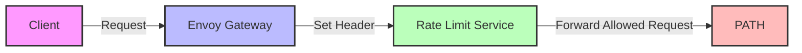

# Rate Limiting <!-- omit in toc -->

- [Introduction](#introduction)
    - [Header-Based Rate Limiting](#header-based-rate-limiting)
    - [Setting Header Values](#setting-header-values)
- [Rate Limiting Configuration](#rate-limiting-configuration)
    - [Adding new rate limit plans](#adding-new-rate-limit-plans)
    - [Multiple rate limits](#multiple-rate-limits)
- [Gateway Helm Configuration](#gateway-helm-configuration)
    - [Documentation References](#documentation-references)


# Introduction

GUARD utilizes Envoy Gateway's Global Rate Limiting functionality, which may be configured in GUARD's `values.yaml` file.

- [GUARD values.yaml](https://github.com/buildwithgrove/helm-charts/blob/main/charts/guard/values.yaml)

This configuration uses Redis as the rate limit backend and allows a simplified configuration of rate limits.

### Header-Based Rate Limiting

Rate limits are enforced using the distinct values of a provided HTTP header.

For example:

| Header Value   | Requests | Unit   | User Identifier Example |
| -------------- | -------- | ------ | ----------------------- |
| `Rl-Plan-Free` | `5000`   | Day    | `1a2b3c4d`              |
| `Rl-Plan-Free` | `30`     | Second | `1a2b3c4d`              |
| `Rl-Plan-Pro`  | `1000`   | Hour   | `5e6f7g8h`              |

The above configuration will enforce the following rate limits for each distinct user identifier with the provided header value:

- 5000 requests per day for the `Rl-Plan-Free` header
- 30 requests per second for the `Rl-Plan-Free` header
- 1000 requests per hour for the `Rl-Plan-Pro` header

```bash
curl http://rpc.grove.city/v1 \ 
    -H "Rl-Plan-Free: 1a2b3c4d" \
    -d '{"jsonrpc":"2.0","method":"eth_blockNumber","id":1}'
```

### Setting Header Values

Header values must be set on each request downstream of the rate limit service. Envoy's configuration provides a number of ways to set headers on requests.

For example:

- [Envoy Gateway HTTP Request Header Modification](https://gateway.envoyproxy.io/docs/tasks/traffic/http-request-headers/)
- [Envoy Gateway Custom External Authorization](https://gateway.envoyproxy.io/docs/tasks/security/ext-auth/)

<!-- TODO_IMPROVE(@commoddity): provide better examples of how to set headers on requests -->




# Rate Limiting Configuration

In the GUARD Helm Chart, the rate limiting configuration is located in the `values.yaml` file

The following table describes all available configuration options for rate limiting:

| Parameter                    | Description                                              | Default          | Required |
| ---------------------------- | -------------------------------------------------------- | ---------------- | -------- |
| `rateLimit.enabled`          | Whether to enable rate limiting                          | `true`           | ✅        |
| `rateLimit.plans`            | Array of rate limit plans                                |                  | ✅        |
| `rateLimit.plans[].header`   | HTTP header to use for identifying rate limit subjects   | `"Rl-Plan-Free"` | ✅        |
| `rateLimit.plans[].requests` | Number of requests allowed per time unit                 | `5000`           | ✅        |
| `rateLimit.plans[].unit`     | Time unit for the rate limit (Second, Minute, Hour, Day) | `Day`            | ✅        |

The default configuration is as follows:

```yaml
rateLimit:
  enabled: true
  plans:
    - header: "Rl-Plan-Free"
      requests: 5000
      unit: Day
```

With this configuration, GUARD will limit the number of requests per day to 5000 for each unique value of the `Rl-Plan-Free` header.

In order for rate limits to be applied, the HTTP header specified in the `header` field must be set on the request.

For example, the following request will be rate limited:

```bash
curl http://rpc.grove.city/v1 \
    -H "Rl-Plan-Free: 1a2b3c4d" \
    -d '{"jsonrpc":"2.0","method":"eth_blockNumber","id":1}'
```

In this example, a user identified by the `Rl-Plan-Free` with a header value of `1a2b3c4d` will be able to make 5000 requests per day. Any requests after that will be rate limited until the end of the day.

### Adding new rate limit plans

To add new rate limiting tiers, you can add new entries to the `plans` array.

For example, to add a new rate limiting tier for 1000 requests per hour for users identified by the `Rl-Plan-Pro` header, you can add the following:

```yaml
plans:
  - header: "Rl-Plan-Free"
    requests: 5000
    unit: Day
  - header: "Rl-Plan-Pro"
    requests: 1000
    unit: Hour
```

With this configuration, GUARD will limit the number of requests per hour to 1000 for each unique value of the `Rl-Plan-Pro` header.

For example, a user identified by the `Rl-Plan-Pro` with a header value of `1a2b3c4d` will be able to make 1000 requests per hour. Any requests after that will be rate limited until the end of the hour.

### Multiple rate limits

Additional rate limits may also be applied to the same plan. For example, the following configuration will create a new rate limit for the `Rl-Plan-Free` header with a limit of 30 requests per second.

```yaml
plans:
  - header: "Rl-Plan-Free"
    requests: 5000
    unit: Day
  - header: "Rl-Plan-Free"
    requests: 30
    unit: Second
```

# Gateway Helm Configuration

The rate limiting configuration must be enabled by applying the following configuration to the `gateway-helm` section of the `values.yaml` file.

This section overrides the default values of the Envoy Gateway Helm charts, which is a dependency of the GUARD chart.

By default, the `gateway-helm` value in the GUARD `values.yaml` file is set to a valid configuration to enable using Redis as the rate limit backend.

```yaml
gateway-helm:
  config:
    envoyGateway:
      rateLimit:
        backend:
          type: Redis
          redis:
            url: redis.path.svc.cluster.local:6379
```

**Note that this configuration should not be modified unless you are changing the namespace that GUARD runs in, which is not recommended.**

_In the case that the namespace is modified, the `gateway-helm.config.envoyGateway.rateLimit.backend.redis.url` value of `redis.<NAMESPACE>.svc.cluster.local:6379` must be updated to the correct Redis service URL, where `<NAMESPACE>` is the namespace that GUARD runs in._

### Documentation References

- For information on the Envoy Gateway Helm Chart's possible configurations, see the following:

  - [Envoy Gateway Helm Chart Values](https://github.com/envoyproxy/gateway/tree/main/charts/gateway-helm#values)
  - [Envoy Gateway Helm Chart Values Template](https://github.com/envoyproxy/gateway/blob/main/charts/gateway-helm/values.tmpl.yaml)

- For information on the Envoy Gateway rate limiting configuration, see the following:

  - [Envoy Gateway Rate Limiting](https://gateway.envoyproxy.io/docs/tasks/traffic/global-rate-limit/)

- For detailed information on the Envoy Proxy rate limiting configuration, see the following:

  - [Envoy Proxy Rate Limit HTTP Filter](https://www.envoyproxy.io/docs/envoy/latest/configuration/http/http_filters/rate_limit_filter)
  - [Envoy Proxy Rate Limit Repo](https://github.com/envoyproxy/ratelimit)