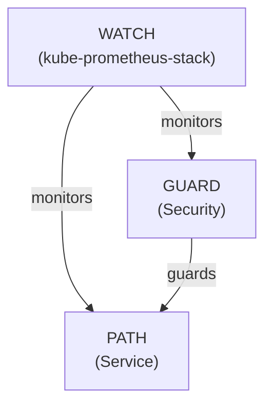

# PATH Integration with WATCH <!-- omit in toc -->

This document explains how to integrate the **PATH** helm chart with the **WATCH** chart (a separate Helm chart that needs to be installed separately) for monitoring using [kube-prometheus-stack](https://github.com/prometheus-community/helm-charts/tree/main/charts/kube-prometheus-stack).

- [Architecture](#architecture)
- [Usage Scenarios](#usage-scenarios)
  - [Scenario 1: Full Stack with Separate Charts](#scenario-1-full-stack-with-separate-charts)
  - [Scenario 2: PATH with Existing Prometheus Stack](#scenario-2-path-with-existing-prometheus-stack)
  - [Scenario 3: PATH Without Observability](#scenario-3-path-without-observability)
- [Configuration](#configuration)
- [Adding Custom Dashboards](#adding-custom-dashboards)
  - [1. Create a Values File with Custom Dashboards](#1-create-a-values-file-with-custom-dashboards)
  - [2. Create Additional ConfigMaps](#2-create-additional-configmaps)
- [Accessing Dashboards](#accessing-dashboards)
- [Troubleshooting](#troubleshooting)
  - [ServiceMonitor Issues](#servicemonitor-issues)
  - [Dashboard Issues](#dashboard-issues)

## Architecture

The observability architecture uses Prometheus Operator's pattern:

1. **PATH Exposes Metrics**: The **PATH** chart configures a service with metrics endpoint.

2. **WATCH Creates ServiceMonitors**: The **WATCH** chart uses ServiceMonitor CRDs to tell Prometheus which services to scrape.

3. **Prometheus Operator Handles Discovery**: The Prometheus Operator watches for ServiceMonitors and configures Prometheus to scrape the metrics endpoints.



## Usage Scenarios

### Scenario 1: Full Stack with Separate Charts

Deploy **PATH** and **WATCH** as separate charts:

1. First, install PATH:

```bash
helm install path grove/path --namespace app
```

2. Then, install WATCH in the monitoring namespace:

```bash
helm install watch grove/watch --namespace monitoring
```

3. Configure WATCH to monitor PATH:

```bash
helm upgrade watch grove/watch --namespace monitoring \
  --set serviceMonitors.path.enabled=true \
  --set serviceMonitors.path.namespace=app \
  --set serviceMonitors.path.selector.matchLabels."app\.kubernetes\.io/name"=path \
  --set dashboards.path.enabled=true
```

### Scenario 2: PATH with Existing Prometheus Stack

If you already have `kube-prometheus-stack` installed:

1. Install PATH:

```bash
helm install path grove/path --namespace app
```

2. Create ServiceMonitor for PATH manually:

```yaml
apiVersion: monitoring.coreos.com/v1
kind: ServiceMonitor
metadata:
  name: path
  namespace: monitoring
spec:
  selector:
    matchLabels:
      app.kubernetes.io/name: path
  namespaceSelector:
    matchNames:
      - app
  endpoints:
    - port: metrics
      interval: 15s
      path: /metrics
```

### Scenario 3: PATH Without Observability

If you want to deploy PATH without any observability components:

```bash
helm install path grove/path --namespace app
```

No additional configuration is needed as WATCH is now a separate chart.

## Configuration

When configuring WATCH to monitor PATH, the following parameters are key:

| Parameter                            | Description                    | Default      |
| ------------------------------------ | ------------------------------ | ------------ |
| `serviceMonitors.path.enabled`       | Enable PATH ServiceMonitor     | `false`      |
| `serviceMonitors.path.namespace`     | PATH namespace to monitor      | `app`        |
| `serviceMonitors.path.selector.matchLabels` | Labels to match PATH service | `{"app.kubernetes.io/name": "path"}` |
| `dashboards.path.enabled`            | Enable PATH dashboards         | `false`      |
| `dashboards.path.folderName`         | Grafana folder for dashboards  | `"PATH"`     |

## Adding Custom Dashboards

There are two approaches to add custom dashboards:

### 1. Create a Values File with Custom Dashboards

```yaml
dashboards:
  custom:
    enabled: true
    dashboards:
      my-dashboard:
        folderName: "PATH Custom"
        json: |
          {
            "title": "PATH Custom Dashboard",
            ...
          }
```

### 2. Create Additional ConfigMaps

After deploying, create ConfigMaps in the monitoring namespace with the proper labels:

```yaml
apiVersion: v1
kind: ConfigMap
metadata:
  name: my-path-dashboard
  namespace: monitoring # Must be in the monitoring namespace
  labels:
    grafana_dashboard: "1"
  annotations:
    grafana_folder: "PATH"
data:
  my-dashboard.json: |
    {
      "title": "My PATH Dashboard",
      ...
    }
```

## Accessing Dashboards

After deploying PATH with WATCH:

1. Get the Grafana service port:

   ```bash
   kubectl get svc -n monitoring | grep grafana
   ```

2. Forward the port to your local machine:

   ```bash
   kubectl port-forward svc/watch-grafana 3000:80 -n monitoring
   ```

3. Access Grafana at [http://localhost:3000](http://localhost:3000) with the following credentials:
   - Username: `admin`
   - Password: from values.yaml (default: `change-me-in-production`)

## Troubleshooting

### ServiceMonitor Issues

If metrics aren't being collected:

1. Verify the ServiceMonitor is created in the monitoring namespace:

   ```bash
   kubectl get servicemonitors -n monitoring
   ```

2. Check if the ServiceMonitor has the correct labels:

   ```bash
   kubectl get servicemonitor <name> -n monitoring -o yaml | grep app.kubernetes.io/part-of
   ```

3. Check if PATH metrics service is accessible from the monitoring namespace:

   ```bash
   # From a pod in the monitoring namespace
   curl path-metrics.app.svc.cluster.local:9090/metrics
   ```

### Dashboard Issues

If dashboards aren't appearing:

1. Check if the ConfigMaps were created:

   ```bash
   kubectl get configmaps -n monitoring -l grafana_dashboard=1
   ```

2. Restart Grafana to detect new dashboards:

   ```bash
   kubectl rollout restart deployment watch-grafana -n monitoring
   ```

3. Check Grafana logs for any dashboard loading errors:

   ```bash
   kubectl logs -l app.kubernetes.io/name=grafana -n monitoring
   ```
