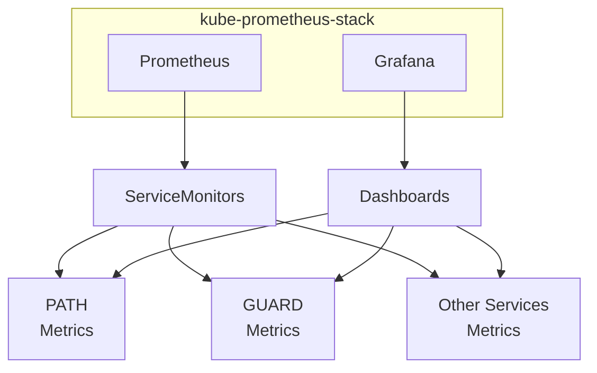
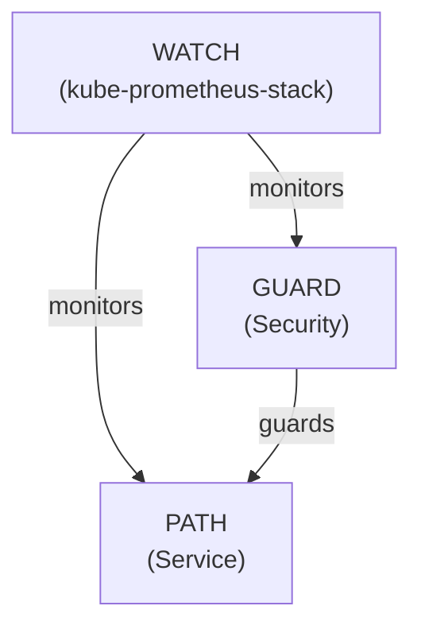
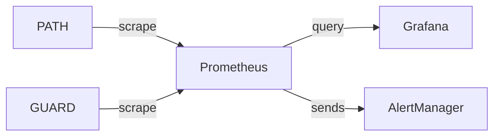

# WATCH Architecture <!-- omit in toc -->

**WATCH** stands for Workload Analytics and Telemetry for Comprehensive Health.

**WATCH** is the observability component of the PATH ecosystem, designed to provide
comprehensive monitoring, alerting, and visualization capabilities for both **PATH** and **GUARD** services.

- [Architecture Components](#architecture-components)
  - [1. Prometheus Operator](#1-prometheus-operator)
  - [2. Prometheus](#2-prometheus)
  - [3. Grafana](#3-grafana)
  - [4. AlertManager](#4-alertmanager)
  - [5. Service Discovery \& Metrics Collection](#5-service-discovery--metrics-collection)
- [Directory Structure](#directory-structure)
- [Integration with PATH and GUARD](#integration-with-path-and-guard)
- [Metrics Flow](#metrics-flow)
- [Deployment Configurations](#deployment-configurations)
  - [When to Use Each Configuration](#when-to-use-each-configuration)
- [Dashboard Organization](#dashboard-organization)
- [Security Architecture](#security-architecture)
- [Scalability Considerations](#scalability-considerations)

## Architecture Components

**WATCH** follows the modern observability pattern with the industry-standard [kube-prometheus-stack](https://github.com/prometheus-community/helm-charts/tree/main/charts/kube-prometheus-stack):

### 1. Prometheus Operator

The core component of [kube-prometheus-stack](https://github.com/prometheus-community/helm-charts/tree/main/charts/kube-prometheus-stack) that manages Prometheus deployments using Kubernetes custom resources:

- Manages Prometheus, AlertManager, and Grafana instances
- Handles ServiceMonitor resources for service discovery
- Manages PrometheusRule resources for alerting rules
- Supports high availability configurations

### 2. Prometheus

A powerful time-series database that serves as the storage backend for metrics collected from PATH and GUARD:

- Scalable metrics collection and storage
- Sophisticated query language (PromQL)
- Flexible alerting capabilities
- High availability options
- Long-term storage with configurable retention

### 3. Grafana

The visualization layer that provides dashboards for monitoring the performance, health, and behavior of both services:

- Pre-configured dashboards for common PATH and GUARD metrics
- Alert management capabilities
- Support for custom dashboard creation
- User management and sharing features

### 4. AlertManager

Handles alerts sent by Prometheus:

- Deduplicates, groups, and routes alerts
- Silences and inhibitions
- Notifications via email, Slack, PagerDuty, etc.

### 5. Service Discovery & Metrics Collection

- Separate ServiceMonitor resources for PATH and GUARD
- Support for metrics scraping configuration
- Integration with Kubernetes service discovery

## Directory Structure

The WATCH chart organizes dashboards by component:

```bash
watch/
├── dashboards/                 # JSON dashboard files
│   ├── path/                   # PATH-specific dashboard JSON
│   │   ├── overview.json
│   │   ├── errors.json
│   │   └── ...
│   └── guard/                  # GUARD-specific dashboard JSON
│       ├── overview.json
│       ├── errors.json
│       └── ...
└── templates/
    ├── _helpers.tpl            # Common template functions
    ├── dashboards-path.yaml    # ConfigMap template for all PATH dashboards
    ├── dashboards-guard.yaml   # ConfigMap template for all GUARD dashboards
    ├── dashboards-custom.yaml  # ConfigMap template for custom dashboards
    ├── servicemonitor-path.yaml # ServiceMonitor for PATH
    ├── servicemonitor-guard.yaml # ServiceMonitor for GUARD
    └── custom-dashboards-README.md  # Documentation for adding dashboards
```

## Integration with PATH and GUARD

Terminology:

- **PATH** provides the core API and tooling capabilities
- **GUARD** acts as the security gateway for PATH, protecting it from unauthorized access
- **WATCH** monitors the health and performance of both **PATH** and **GUARD** independently

With **GUARD** and **PATH**, `kube-prometheus-stack` provides monitoring and observability for both components:



**WATCH** completes the ecosystem by providing visibility into both PATH and GUARD components:



## Metrics Flow

1. Both **PATH** and **GUARD** services expose Prometheus-compatible metrics endpoints independently
2. **WATCH**'s ServiceMonitors discover and scrape these endpoints directly based on label selectors
3. Prometheus stores the collected metrics from both sources
4. Grafana dashboards query Prometheus to visualize the data from both PATH and GUARD



## Deployment Configurations

:::warning TODO

TODO_UPNEXT(@HebertCL): Adjust and document WATCH deployed as part of an already existing monitoring solution & deploying separate components

:::

**WATCH** can be deployed in several configurations:

1. **Standalone** - Complete observability stack with kube-prometheus-stack
2. **Integration** - Dashboards and configurations for existing monitoring infrastructure
3. **Hybrid** - Mix and match components as needed for your environment

### When to Use Each Configuration

- **Standalone**: Best for new deployments without existing monitoring
- **Integration**: Use when you already have a monitoring stack but want PATH and GUARD dashboards
- **Hybrid**: Useful when migrating from an existing monitoring solution

## Dashboard Organization

Dashboards are organized by both component (PATH/GUARD) and functional category:

1. **Service Health** - Overall uptime, response times, and availability
2. **Performance Metrics** - Request rates, latencies, and resource utilization
3. **Error Analysis** - Error rates, types, and debugging information
4. **Resource Usage** - CPU, memory, and network utilization
5. **User Activity** - Request patterns and user behavior analytics

This organization makes it easy to find the right dashboard for a specific monitoring need.

## Security Architecture

**WATCH** incorporates security best practices:

1. **ServiceAccount**: Dedicated service account with minimal permissions
2. **RBAC**: Role-based access control for metrics collection
3. **Network Policies**: Optional network policies to restrict traffic
4. **Authentication**: Grafana authentication and authorization
5. **Encryption**: Support for TLS encryption for all components

## Scalability Considerations

- Prometheus supports horizontal scaling for large deployments
- Configurable resource limits and requests for all components
- Support for retention policies to manage storage requirements
- Thanos integration for long-term storage (optional)
