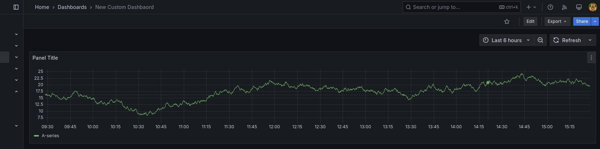

# WATCH Dashboard Implementation Guide <!-- omit in toc -->

This guide provides detailed instructions for adding and managing dashboards for
both **PATH** and **GUARD** components in the **WATCH** observability stack.

- [Directory Structure](#directory-structure)
- [Adding a New Dashboard](#adding-a-new-dashboard)
  - [1. Create the Dashboard JSON](#1-create-the-dashboard-json)
  - [2. Add the JSON File to the Correct Component Directory](#2-add-the-json-file-to-the-correct-component-directory)
  - [3. Update Dashboard Data Source References](#3-update-dashboard-data-source-references)
- [Dashboard Best Practices](#dashboard-best-practices)
  - [1. Use Variables](#1-use-variables)
  - [2. Consistent Naming](#2-consistent-naming)
  - [3. Dashboard Organization](#3-dashboard-organization)
  - [4. Testing Your Dashboard](#4-testing-your-dashboard)
- [Adding Custom Dashboard Provider Values](#adding-custom-dashboard-provider-values)
- [Prometheus Metrics and PromQL](#prometheus-metrics-and-promql)
  - [PATH Metrics](#path-metrics)
  - [GUARD Metrics](#guard-metrics)
- [Troubleshooting](#troubleshooting)
  - [Dashboard Not Appearing in Grafana](#dashboard-not-appearing-in-grafana)
  - [Common Issues](#common-issues)
- [Adding a New Component](#adding-a-new-component)

## Directory Structure

The **WATCH** chart organizes dashboards by component:

```bash
watch/
├── dashboards/                 # JSON dashboard files
│   ├── path/                   # PATH-specific dashboard JSON
│   │   ├── overview.json
│   │   ├── errors.json
│   │   └── ...
│   └── guard/                  # GUARD-specific dashboard JSON
│       ├── overview.json
│       ├── errors.json
│       └── ...
└── templates/
    ├── dashboards-path.yaml    # ConfigMap template for all PATH dashboards
    ├── dashboards-guard.yaml   # ConfigMap template for all GUARD dashboards
    └── dashboards-custom.yaml  # ConfigMap template for custom dashboards
```

## Adding a New Dashboard

### 1. Create the Dashboard JSON

First, create your dashboard in Grafana and export it as JSON:

1. Design and save your dashboard in Grafana
2. Click the Share icon in the dashboard top menu



3. Select the "Export" tab
4. Choose "Save to file" (ensure "Export for sharing externally" is NOT checked)

### 2. Add the JSON File to the Correct Component Directory

Place your exported JSON file in the appropriate directory:

- For **PATH** dashboards: `dashboards/path/<replace-me-with-your-dashboard-name>.json`
- For **GUARD** dashboards: `dashboards/guard/<replace-me-with-your-dashboard-name>.json`

That's it! The dashboard will be automatically detected and loaded by the appropriate template.
There's no need to create individual YAML files for each dashboard.

### 3. Update Dashboard Data Source References

If you exported the dashboard from another Grafana instance, you may need to update the data source references to match your Prometheus deployment:

1. Open the JSON file in a text editor
2. Look for `"datasource"` entries
3. Update them to match your Prometheus data source name:

Original:

```json
"datasource": {
  "type": "prometheus",
  "uid": "abcd1234"
}
```

Updated for kube-prometheus-stack:

```json
"datasource": {
  "type": "prometheus",
  "uid": "${DS_PROMETHEUS}"
}
```

## Dashboard Best Practices

### 1. Use Variables

To make dashboards reusable and configurable:

```json
{
  "templating": {
    "list": [
      {
        "name": "job",
        "type": "query",
        "datasource": "${DS_PROMETHEUS}",
        "query": "label_values(job)"
      },
      {
        "name": "instance",
        "type": "query",
        "datasource": "${DS_PROMETHEUS}",
        "query": "label_values(up{job=~\"$job\"}, instance)"
      }
    ]
  }
}
```

### 2. Consistent Naming

Use consistent naming patterns to make dashboards discoverable:

- **PATH** dashboards: `path-[function]-[detail].json`
- **GUARD** dashboards: `guard-[function]-[detail].json`

The filename (without the `.json` extension) will be used as part of the ConfigMap name,
so avoid special characters and keep names concise.

### 3. Dashboard Organization

Structure your dashboard with logical panel groups:

1. **Top row**: Overview metrics and health indicators
2. **Middle rows**: Detailed metrics organized by category
3. **Bottom rows**: Resource usage and system metrics

### 4. Testing Your Dashboard

Test your dashboard before committing.

Validate the syntax and structure of your JSON file:

```bash
helm lint watch/
```

Render the template to verify ConfigMap generation for PATH dashboards:

```bash
helm template watch/ --show-only templates/dashboards-path.yaml
```

Render the template to verify ConfigMap generation for GUARD dashboards:

```bash
helm template watch/ --show-only templates/dashboards-guard.yaml
```

## Adding Custom Dashboard Provider Values

To provide dashboards through Helm values:

```yaml
dashboards:
  custom:
    enabled: true
    dashboards:
      my-dashboard:
        folderName: "Custom"
        json: |
          {
            "title": "My Custom Dashboard",
            "panels": [
              {
                "title": "Request Rate",
                "type": "graph",
                ...
              }
            ]
          }
```

Custom dashboards defined in values can also use Helm templating by utilizing the `tpl` function in the template.

## Prometheus Metrics and PromQL

When creating dashboards for kube-prometheus-stack, use the following PromQL query patterns:

### PATH Metrics

Examples of common PATH metrics:

```promql
# Request Rate
sum(rate(http_requests_total{job="path-api"}[5m])) by (path)

# Error Rate
sum(rate(http_requests_total{job="path-api", status=~"5.."}[5m])) by (path)

# Latency (95th percentile)
histogram_quantile(0.95, sum(rate(http_request_duration_seconds_bucket{job="path-api"}[5m])) by (path, le))
```

### GUARD Metrics

Examples of common GUARD metrics:

```promql
# Authentication Rate
sum(rate(auth_requests_total{job="guard-api"}[5m])) by (path)

# Authentication Failures
sum(rate(auth_failures_total{job="guard-api"}[5m])) by (reason)

# Rate Limiting
sum(rate(rate_limited_requests_total{job="guard-api"}[5m])) by (path)
```

## Troubleshooting

### Dashboard Not Appearing in Grafana

1. Check if the ConfigMaps were created:

   ```bash
   kubectl get configmaps -n <namespace> | grep dashboard
   ```

2. Verify Grafana sidecar logs:

   ```bash
   kubectl logs -n <namespace> deployment/watch-grafana -c sidecar
   ```

3. Ensure JSON is valid:

   ```bash
   cat dashboards/<component>/<dashboard-name>.json | jq
   ```

### Common Issues

- **Invalid JSON**: Verify JSON syntax with a tool like `jq`
- **Incorrect Path**: Make sure your JSON files are in the correct directory
- **Missing Conditional**: Check if the appropriate component is enabled in values.yaml
- **Grafana Folder Issues**: Verify folder annotations are correct
- **File Name Issues**: Ensure dashboard filenames don't contain special characters that could cause issues when used in Kubernetes resource names
- **Data Source References**: Check that data source references match your Prometheus data source

## Adding a New Component

To add dashboards for a new component:

1. Create a new directory for dashboard JSON files:

   ```bash
   mkdir -p dashboards/new-component
   ```

2. Add configuration to values.yaml:

   ```yaml
   dashboards:
     newComponent:
       enabled: true
       folderName: "New Component"
   ```

3. Create a template file for the new component:

   ```bash
   touch templates/dashboards-new-component.yaml
   ```

4. Use this template for the new component's dashboard ConfigMap generation:

   ```yaml
   {{- if and .Values.dashboards.enabled .Values.dashboards.newComponent.enabled }}
   {{- range $path, $bytes := .Files.Glob "dashboards/new-component/*.json" }}
   ---
   apiVersion: v1
   kind: ConfigMap
   metadata:
     name: {{ include "watch.fullname" $ }}-dashboard-new-component-{{ base $path | trimSuffix ".json" | lower | replace "_" "-" }}
     namespace: {{ $.Values.global.namespace | default $.Release.Namespace }}
     labels:
       {{- include "watch.labels" $ | nindent 4 }}
       grafana_dashboard: "1"
     annotations:
       grafana_folder: {{ $.Values.dashboards.newComponent.folderName | default "New Component" | quote }}
   data:
     {{ base $path }}: |-
   {{ $.Files.Get $path | indent 4 }}
   {{- end }}
   {{- end }}
   ```

5. Add ServiceMonitor if needed:

   ```yaml
   serviceMonitors:
     newComponent:
       enabled: true
       namespace: "" # Defaults to serviceMonitors.namespace if empty
       labels: {} # Additional labels, merged with serviceMonitors.labels
       selector:
         matchLabels:
           app.kubernetes.io/name: new-component
       endpoints:
         - port: metrics
           interval: 15s
           path: /metrics
   ```

6. Create the corresponding ServiceMonitor template:

   ```bash
   touch templates/servicemonitor-new-component.yaml
   ```

7. Follow the steps above to add dashboard JSON files for the new component
